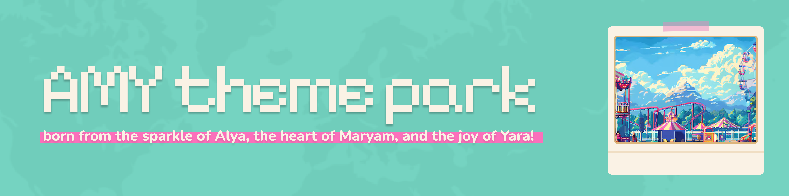
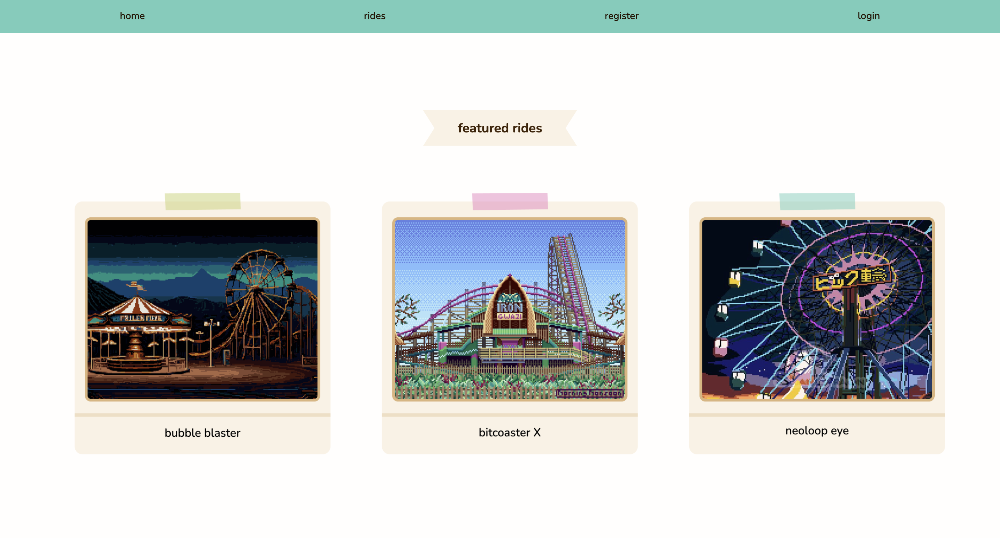

# AMY Theme Park

## Date: 06/08/2025

### By: Alya Alaali, Maryam Ali Redha, and Yara Ismaeel

---

### **Description**

####
Once upon a time, three names — Alya, Maryam, and Yara — came together to inspire something joyful, functional, and just a little bit magical: AMY.

AMY isn’t your average theme park booking app. It’s a full-stack MERN application built to make your theme park experience smoother, smarter, and easier to share with the people you love.

Imagine this:
You want to celebrate a birthday, plan a family day, or just book a thrill ride with friends. 

Instead of standing in lines or juggling paper tickets, you open **AMY**.

---

### **Technologies Used**

####

This project was:

Programmed using VS Code v1.101.2
- Front-end: React & CSS
- Back-end: MongoDB, Express, Node.js

[Back-end repo](https://github.com/maryamalihasanebrahim/adhari_park_backend)

Designed using Figma v125.5.6

---
### **ERD**

---
### **WireFrames**
#### **Login Form**

#### **Booking Form**

#### **View Rides**

#### **View Bookings**

---
### **Component Hierarchy Diagram**

### **Screenshots**

#### Landing Page

#### Sign Up

#### Rides

#### Booking Ride

#### Ride Details

---
